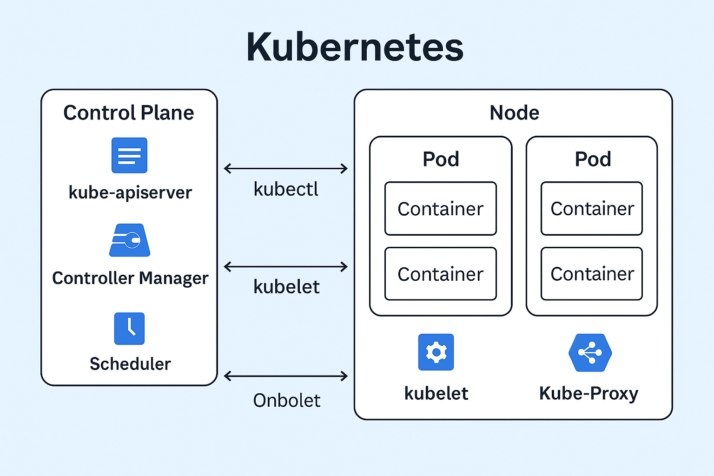

# 🏗 Day 0 – Kubernetes Architecture 

This document explains the **Kubernetes architecture** and its main components, divided into **Master Node** and **Worker Node** roles.

---
## 📌 Architecture Diagram

---

## 🖥 Master Node Components

1. **API Server**

   * The entry point for all Kubernetes operations.
   * Validates and processes requests from `kubectl` or other API clients.

2. **Scheduler**

   * Assigns workloads (Pods) to available worker nodes based on resources & policies.

3. **Controller Manager**

   * Monitors the cluster state and makes changes to match the desired state.

4. **etcd**

   * A distributed key-value store for all cluster data (configuration, state, etc.).

---

## ⚙ Worker Node Components

1. **Kubelet**

   * Communicates with the API Server and ensures containers in Pods are running.

2. **Kube-Proxy**

   * Manages networking, allowing communication between Pods and services.

3. **Pods**

   * The smallest deployable unit in Kubernetes, containing one or more containers.

---

## 🔄 How `kubectl` Works

* You write a YAML manifest (e.g., for a Pod, Service, Deployment).
* `kubectl apply -f file.yaml` sends the manifest to the **API Server**.
* API Server stores the desired state in **etcd**, and the Scheduler assigns the workload to a worker node.
* Kubelet on that worker node creates and manages the containers.

---

## 🗂 Namespaces

* Namespaces are **logical partitions** within a Kubernetes cluster.
* They help organize resources and apply different access or resource limits.
* Common default namespaces:

  * `default` – for workloads without a specific namespace.
  * `kube-system` – system components.
  * `kube-public` – publicly readable resources.

---

**Author:** Manoranjan Sethi

\#Kubernetes #DevOps #Architecture #CloudNative #LearningInPublic