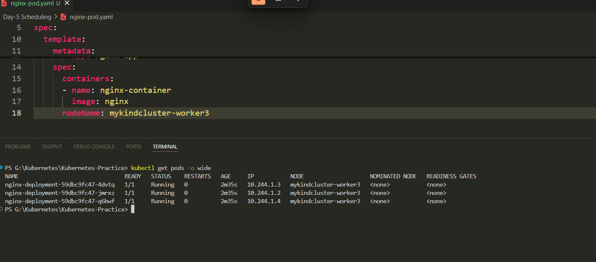
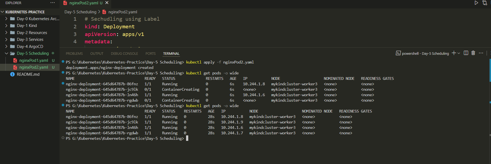
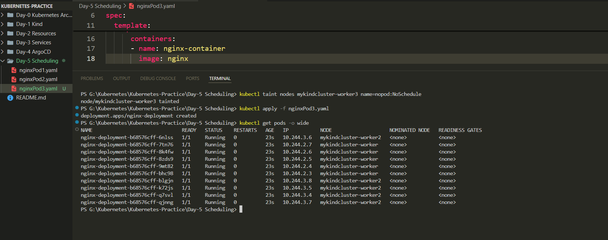
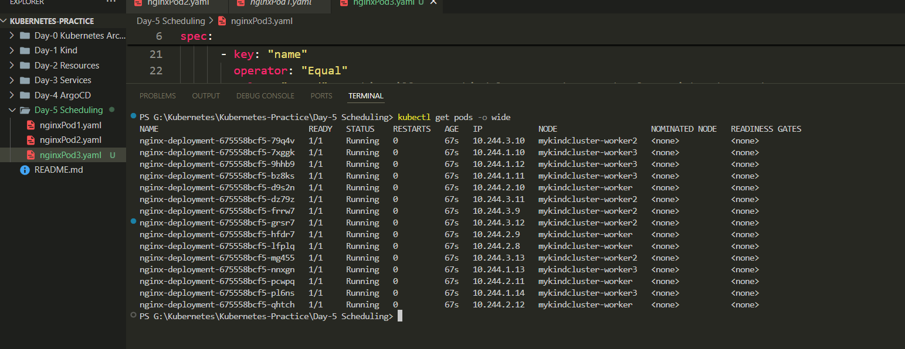
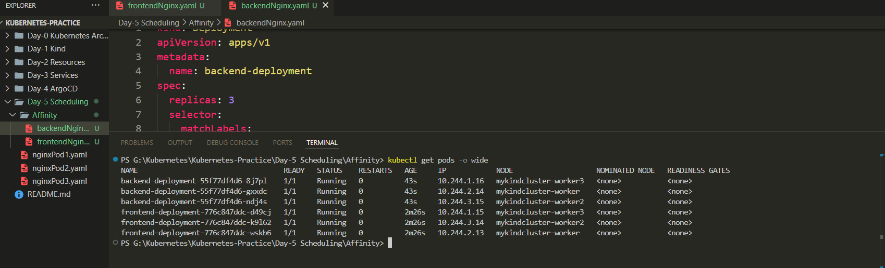

# Day 5 – Kubernetes Scheduling

## 📌 Overview
Scheduling in Kubernetes is the process of assigning newly created Pods to appropriate Nodes in the cluster, considering resource requirements, constraints, and policies.  
Today, I explored **5 different ways** to control Pod placement in a Kubernetes cluster.

---

## 1️⃣ Using `nodeName`
Directly pins Pods to a specific Node.
```yaml
nodeName: mykindcluster-worker3
````

**Use case:** When you want all Pods of a Deployment on **exactly one Node**.

---

## 2️⃣ Using Labels & `nodeSelector`

First, label the Node:

```bash
kubectl label nodes mykindcluster-worker3 config=morememory
```

Then target it in the Pod spec:

```yaml
nodeSelector:
  config: morememory
```

**Use case:** Target multiple Nodes with the same label, unlike `nodeName` which pins to one Node.

---

## 3️⃣ Using Taints & Tolerations

**Taint**: Prevents Pods from being scheduled on a Node.

```bash
kubectl taint nodes mykindcluster-worker3 name=nopod:NoSchedule
```

**Toleration**: Allows specific Pods to bypass a taint.

```yaml
tolerations:
- key: "name"
  operator: "Equal"
  value: "nopod"
  effect: "NoSchedule"
```

**Use case:** Keep certain Nodes free for special workloads unless explicitly allowed.

---

## 4️⃣ Pod Affinity

Ensures Pods are placed together, useful for reducing latency between dependent services (e.g., Frontend and Backend Pods).

```yaml
affinity:
  podAffinity:
    requiredDuringSchedulingIgnoredDuringExecution:
      - labelSelector:
          matchExpressions:
            - key: app
              operator: In
              values:
                - backend
        topologyKey: "kubernetes.io/hostname"
```

**Use case:** Co-locate services that depend on each other.

---

## 5️⃣ Pod Anti-Affinity

Ensures Pods are placed on **different** Nodes for high availability.

---

## 📝 Key Takeaways

* **`nodeName`** → Exact Node targeting.
* **`nodeSelector`** → Multiple Node targeting via labels.
* **Taints/Tolerations** → Control where Pods *cannot* go unless explicitly allowed.
* **Pod Affinity** → Place dependent Pods together.
* **Pod Anti-Affinity** → Spread Pods apart.

---

## 📷 Screenshots

Deployment using NodeName



Deployment using Label



Deployment using Taint



Deployment using Toleration



Deployment using Affinity



---

## 🔗 Related

* [Kubernetes Documentation – Scheduling](https://kubernetes.io/docs/concepts/scheduling-eviction/)

---

**#Kubernetes #DevOps #CloudNative #K8s #Scheduling #Pods #Docker #InfrastructureAsCode**

