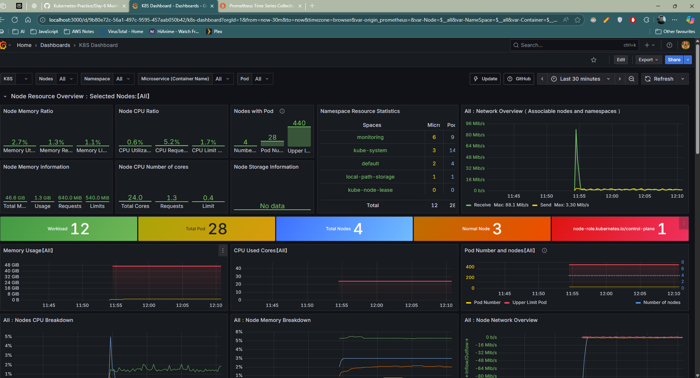
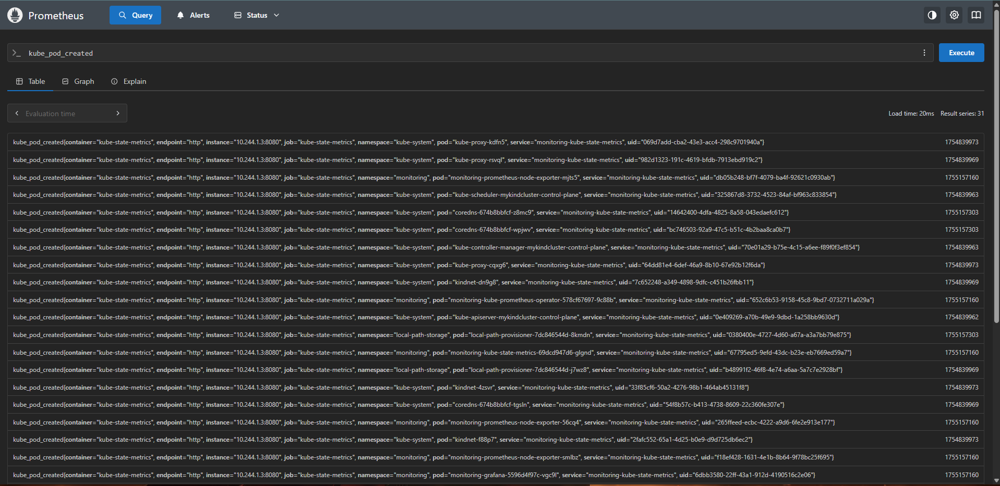

# Day 6 – Monitoring in Kubernetes with Prometheus & Grafana

## 📌 Overview
Monitoring is an essential part of Kubernetes operations.  
Today, I deployed **Prometheus** and **Grafana** to monitor my Kubernetes cluster and visualize real-time metrics such as CPU usage, memory consumption, pod status, and node information.

---

## 📊 Why Prometheus & Grafana?
- **Prometheus** → A metrics collection and alerting tool that uses **PromQL** for querying.
- **Grafana** → A visualization tool that connects to Prometheus and displays data in dashboards.

Prometheus collects raw data, and Grafana turns it into insights.

---

## 🔍 Sample PromQL Queries

```promql
# Total memory usage of all pods in 'dev' namespace
sum(container_memory_usage_bytes{namespace="dev"}) by (pod)

# CPU usage of all pods in 'default' namespace (1-minute average)
sum(rate(container_cpu_usage_seconds_total{namespace="default"}[1m])) by (pod)

# Number of running containers in 'default' namespace
count(container_last_seen{namespace="default"})

# Total number of nodes
count(kube_node_info)

# Total number of pods
count(kube_pod_info)
````

---

## ⚙️ Installation Steps

### 1️⃣ Create a Namespace for Monitoring

```bash
kubectl create namespace monitoring
```

### 2️⃣ Add Prometheus Helm Repository

```bash
helm repo add prometheus-community https://prometheus-community.github.io/helm-charts
helm repo update
```

### 3️⃣ Install Kube-Prometheus-Stack

```bash
helm install monitoring prometheus-community/kube-prometheus-stack --namespace monitoring
```

---

## 📌 Important Services

* **`prometheus-node-exporter`** → Extracts CPU, memory, and pod stats from all nodes.
* **`kube-prometheus-prometheus`** → Stores metrics data.
* **`grafana`** → Visualization dashboard.

Check services:

```bash
kubectl get svc -n monitoring
```

Patch the Type from ClusterIP to Node Port and changing the ports

```bash
kubectl patch svc monitoring-grafana -n monitoring --type=merge -p '{"spec":{"type":"NodePort","ports":[{"port":80,"targetPort":80,"nodePort":31000}]}}'
kubectl patch svc monitoring-kube-prometheus-alertmanager -n monitoring --type=merge -p '{"spec":{"type":"NodePort","ports":[{"name":"main","port":9093,"targetPort":9093,"nodePort":32000},{"name":"web","port":8080,"targetPort":8080,"nodePort":30681}]}}'

kubectl patch svc monitoring-prometheus-node-exporter -n monitoring --type=merge -p '{"spec":{"type":"NodePort","ports":[{"name":"metrics","port":9100,"targetPort":9100,"nodePort":32001}]}}'

kubectl patch svc monitoring-kube-prometheus-prometheus -n monitoring --type=merge -p '{"spec":{"type":"NodePort","ports":[{"name":"http-main","port":9090,"targetPort":9090,"nodePort":30000},{"name":"http-web","port":8080,"targetPort":8080,"nodePort":31782}]}}'
```

---

## 🌐 Accessing the Tools

### **Prometheus**

```bash
kubectl port-forward svc/monitoring-kube-prometheus-prometheus -n monitoring 9090:9090 --address 0.0.0.0
```

Then open in browser:

```
http://localhost:9090
```

### **Grafana**

```bash
kubectl port-forward svc/monitoring-grafana -n monitoring 3000:3000 --address 0.0.0.0
```

Then open in browser:

```
http://localhost:3000
```

**Default Login:**

```
Username: admin
Password: prom-operator
```

---

## 📈 Visualization in Grafana

1. Go to **Configuration → Data Sources**.
2. Add Prometheus with URL: `http://monitoring-kube-prometheus-prometheus:9090`.
3. Import a dashboard by **ID** from Grafana’s dashboard library.
4. Monitor CPU, memory, and pod status in real-time.

---

## 📷 Output

*Deployed 4 NGINX pods and visualized metrics in Grafana:*

* CPU usage per pod.
* Memory consumption per namespace.
* Total nodes and pods count.
* Live container counts.

---
## 📷 Screenshots

Grafana Dashboard



Prometheus Query



Installing HELM


Prometheus Services


---
`Kubernetes` `Prometheus` `Grafana` `K8s Monitoring` `Helm` `Observability` `DevOps`

