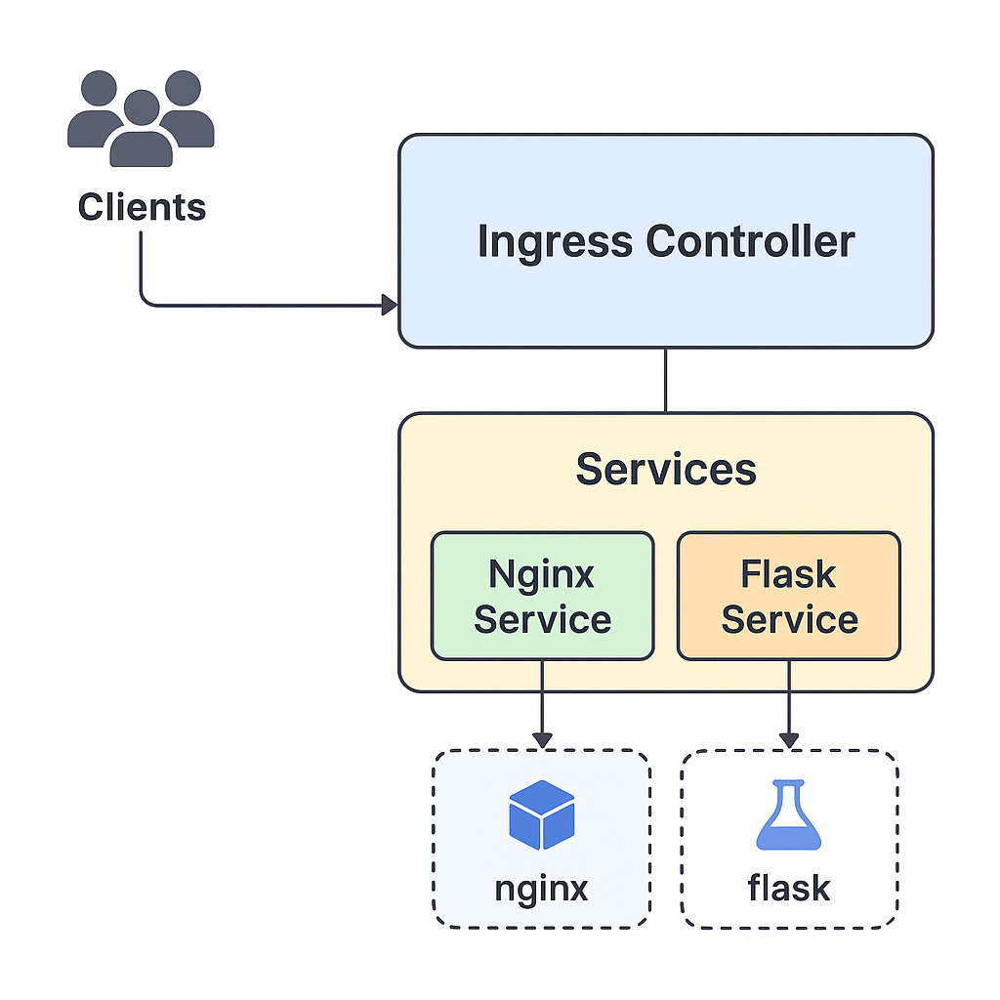
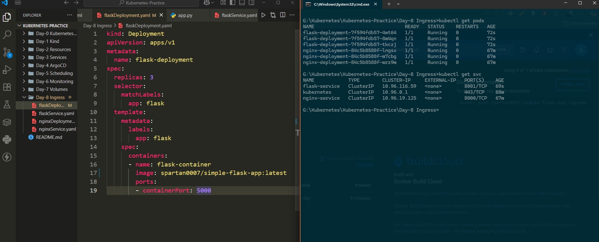
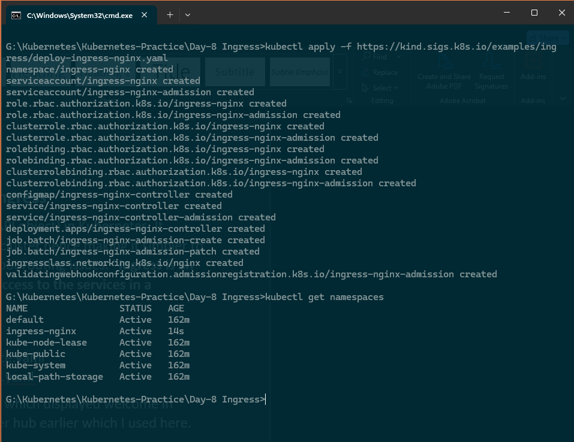
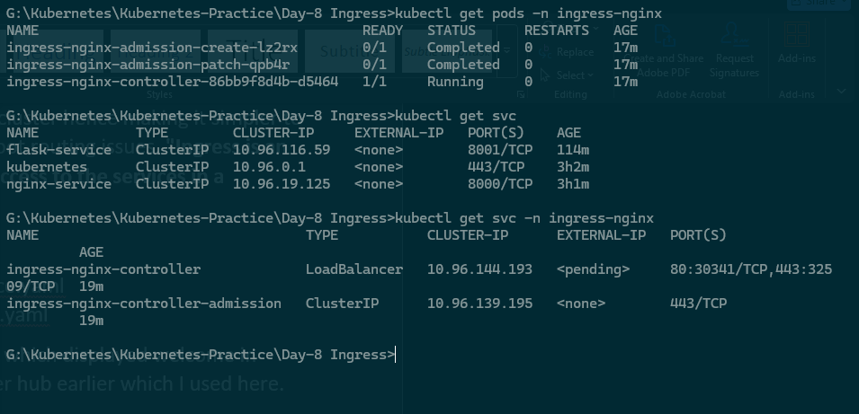
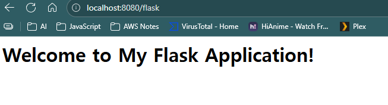
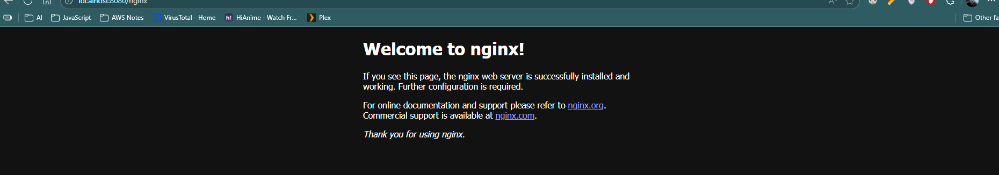

# 🌐 Day 8 – Kubernetes Ingress

This document explains **Ingress** in Kubernetes, its purpose, and the steps to configure it.  
Ingress acts as a single-entry point for routing external traffic to multiple services inside a Kubernetes cluster.

---

## 📌 What is Ingress?

- **Ingress** is an API object that manages **external access** (HTTP/HTTPS) to services in a cluster.  
- Provides a **single-entry point** for multiple applications.  
- Simplifies routing, improves security, and centralizes traffic management.  
- Requires an **Ingress Controller** (like NGINX Ingress Controller) running inside the cluster.  

---

## 🗂️ YAML Files Created

1. **NginxDeployment.yaml** – Deploys an Nginx Pod with a Service.  
2. **FlaskDeployment.yaml** – Deploys a Flask Pod (custom Docker image with a welcome page) with a Service.  
3. **NginxService.yaml** – Exposes Nginx Deployment inside the cluster.  
4. **FlaskService.yaml** – Exposes Flask Deployment inside the cluster.  
5. **IngressConnection.yaml** – Defines routing rules for `/nginx` and `/flask`.

---

## ⚙️ Setup Steps

1. **Install Ingress Controller**  
    ```bash
   kubectl apply -f https://kind.sigs.k8s.io/examples/ingress/deploy-ingress-nginx.yaml
    ```

    Verify controller pods:

    ```bash
    kubectl get pods -n ingress-nginx
    ```

2. **Deploy Applications & Services**

   ```bash
   kubectl apply -f NginxDeployment.yaml
   kubectl apply -f FlaskDeployment.yaml
   kubectl apply -f NginxService.yaml
   kubectl apply -f FlaskService.yaml
   ```

3. **Create Ingress Resource**
   Define rules for routing:

   ```yaml
   annotations:
     nginx.ingress.kubernetes.io/rewrite-target: /
   ```

   Example:

   * `/nginx` → Nginx Service
   * `/flask` → Flask Service

   Deploy Ingress:

   ```bash
   kubectl apply -f IngressConnection.yaml
   ```

4. **Port Forward Ingress Controller**

   ```bash
   kubectl port-forward svc/ingress-nginx-controller -n ingress-nginx 8080:80
   ```

   * Access Nginx → [http://localhost:8080/nginx](http://localhost:8080/nginx)
   * Access Flask → [http://localhost:8080/flask](http://localhost:8080/flask)

5. **Annotation to Capture Paths**
   Regex routing:

   ```yaml
   annotations:
        nginx.ingress.kubernetes.io/rewrite-target: /$1
        nginx.ingress.kubernetes.io/use-regex: "true"
   ```
   ```yaml
     - pathType: ImplementationSpecific
        path: /flask/(.*) 
   ```

   * Access Flask/About → [http://localhost:8080/flask/about](http://localhost:8080/flask)

---

## 🔎 Troubleshooting

* Without annotation, paths like `/flask/about` may fail.
* Add regex and change `pathType` to `ImplementationSpecific` for proper sub-path handling.

---

## 🖼️ Ingress Architecture



## 📷 Screenshots

Deployment and Services



Ingress Installation



Ingress Namespace and Controller



Flask App 



Nginx App



*Ingress routes external traffic via the NGINX Ingress Controller to backend services.*
