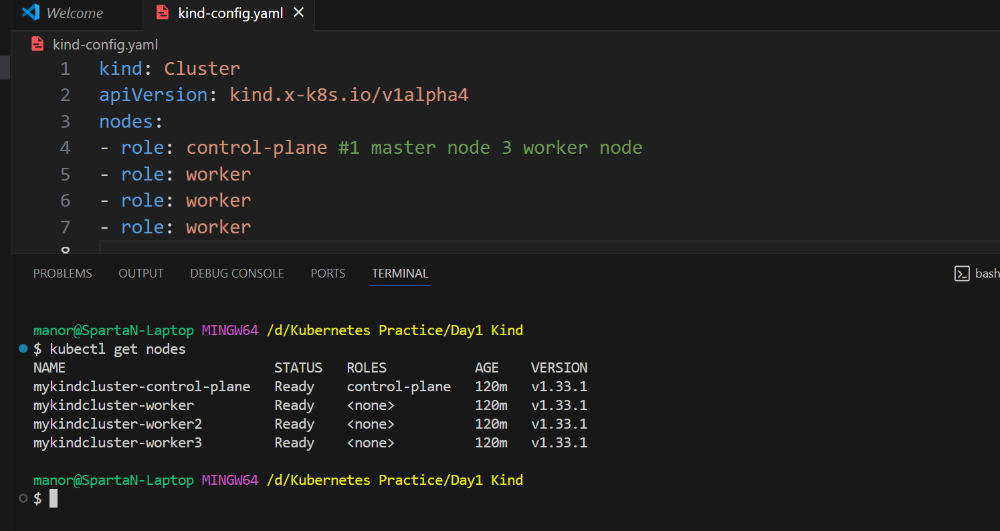
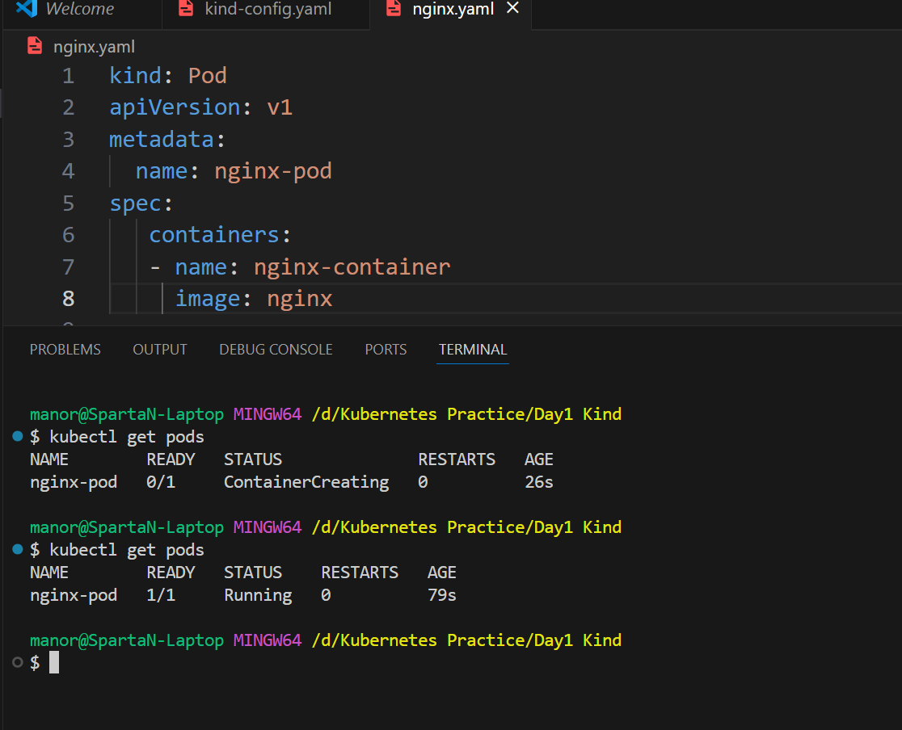
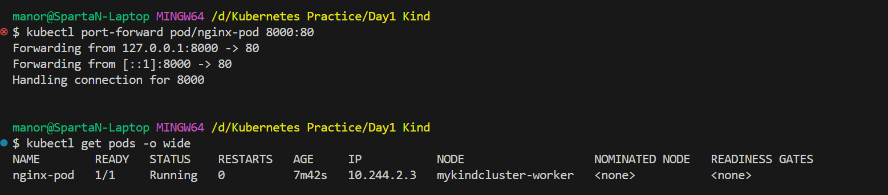
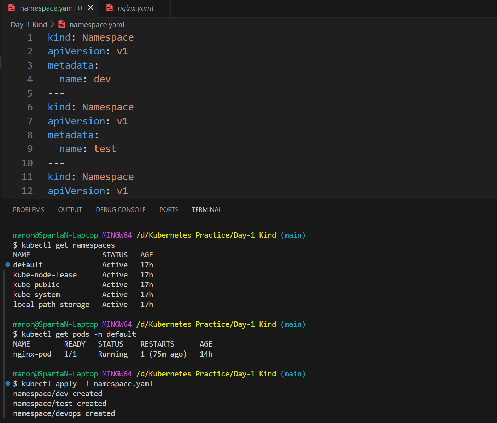
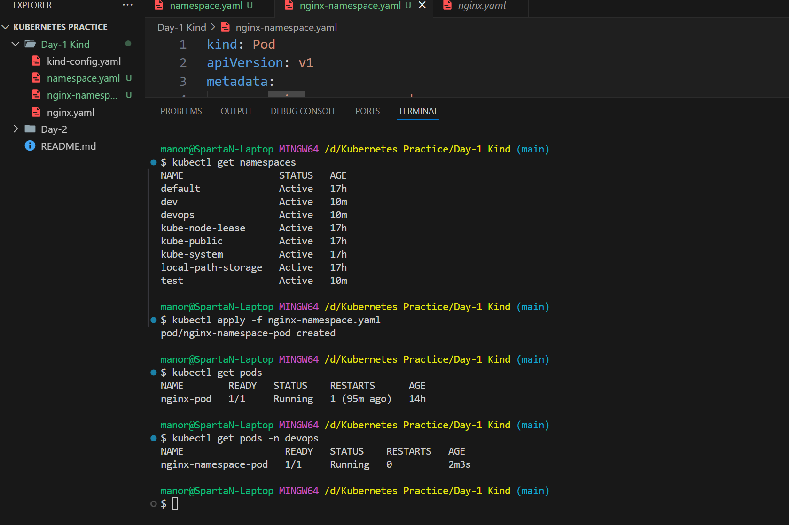

# 🐳 Kubernetes Day 1 – KIND Cluster & Namespaces

This project demonstrates setting up a **Kubernetes cluster locally** using **KIND (Kubernetes IN Docker)** with **1 master node** and **3 worker nodes**, deploying an Nginx pod, and working with Kubernetes namespaces.

---

## 📦 Cluster Setup

### 1️⃣ Install Dependencies
- **Chocolatey** (Windows package manager)
- **Kind**
- **kubectl**

### 2️⃣ KIND Cluster Configuration (`kind-config.yaml`)
```yaml
kind: Cluster
apiVersion: kind.x-k8s.io/v1alpha4
nodes:
- role: control-plane # 1 master node
- role: worker
- role: worker
- role: worker
````

### 3️⃣ Create Cluster

```bash
kind create cluster --name mykindcluster --config kind-config.yaml
```

```bash
kind delete cluster --name mykindcluster
```

### 4️⃣ Verify Nodes

```bash
kubectl get nodes
```

---

## 🚀 Deploying a Pod

### Nginx Pod Manifest (`nginx.yaml`)

```yaml
apiVersion: v1
kind: Pod
metadata:
  name: nginx-pod
spec:
  containers:
  - name: nginx-container
    image: nginx
```

### Apply Pod

```bash
kubectl apply -f nginx.yaml
```

### Access Application via Port Forwarding

```bash
kubectl port-forward pod/nginx-pod 8000:80
```

### Get Pod Details

```bash
kubectl get pods -o wide
```

---

## 🗂 Working with Namespaces

### Namespace Manifest (`namespace.yaml`)

```yaml
kind: Namespace
apiVersion: v1
metadata:
  name: dev
---
kind: Namespace
apiVersion: v1
metadata:
  name: test
---
kind: Namespace
apiVersion: v1
metadata:
  name: devops
```

### Apply Namespaces

```bash
kubectl apply -f namespace.yaml
kubectl get namespaces
```

---

## 📌 Deploying Pod in a Namespace

### Nginx in `devops` Namespace (`nginx-namespace.yaml`)

```yaml
kind: Pod
apiVersion: v1
metadata:
  name: nginx-namespace-pod
  namespace: devops
spec:
  containers:
    - name: nginx-namespace-pod
      image: nginx
```

### Apply & Verify

```bash
kubectl apply -f nginx-namespace.yaml
kubectl get pods -n devops
```

---

## 🧠 Key Learnings

* KIND can simulate multi-node clusters locally using Docker containers.
* `kubectl` sends YAML manifests to the API Server, which schedules workloads.
* Namespaces allow logical separation of workloads within the same cluster.

---

## 📸 Screenshots











---

**Author:** Manoranjan Sethi

#Kubernetes #DevOps #Kind #Kubectl #Namespaces