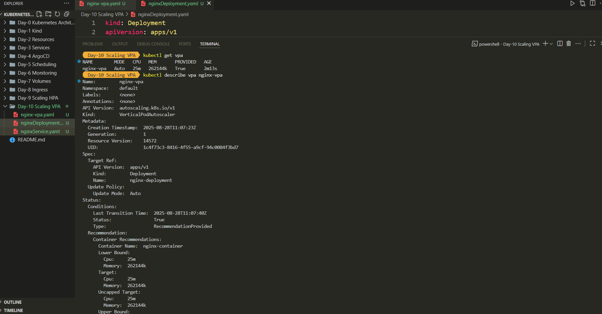
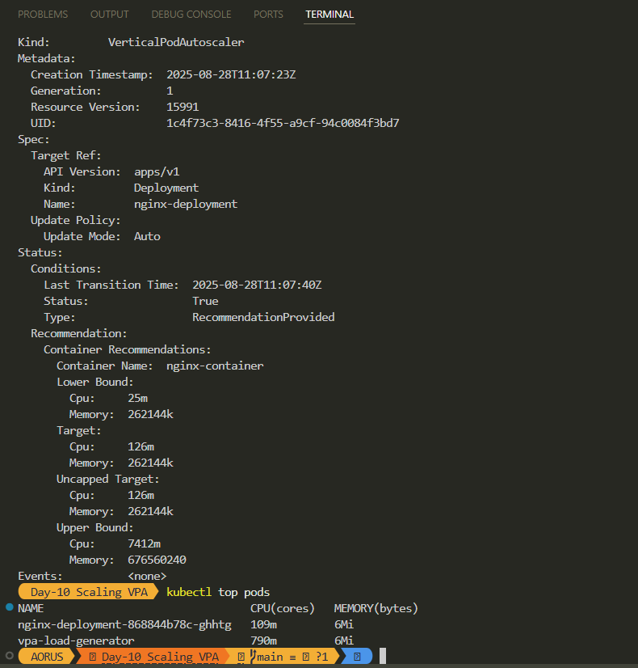

# Day 10 – Kubernetes Scaling (VPA & DaemonSets)

## 📌 Vertical Pod Autoscaler (VPA)

**What is VPA?**  
The Vertical Pod Autoscaler (VPA) automatically adjusts CPU and Memory **requests/limits** for containers in a Pod based on actual usage.  
Unlike HPA (Horizontal Pod Autoscaler), which scales **out** by increasing the number of Pods, VPA scales **up** by allocating more resources to existing Pods.

### ✅ How I set it up:
1. Installed VPA from the [kubernetes/autoscaler](https://github.com/kubernetes/autoscaler) repo:
   ```bash
   git clone https://github.com/kubernetes/autoscaler.git
   cd autoscaler/vertical-pod-autoscaler/
   ./vpa-up.sh

2. Created `nginxDeployment.yaml` and `nginxService.yaml` (replicas = 1).
3. Added **VPA manifest** (`nginx-vpa.yaml`):

   ```yaml
   apiVersion: autoscaling.k8s.io/v1
   kind: VerticalPodAutoscaler
   metadata:
     name: nginx-vpa
   spec:
     targetRef:
       apiVersion: "apps/v1"
       kind: Deployment
       name: nginx-deployment
     updatePolicy:
       updateMode: "Auto"
   ```
4. Verified VPA:

   ```bash
   kubectl get vpa
   kubectl describe vpa nginx-vpa
   ```

### 📊 Observations:

* Initially, VPA recommended:

  * **CPU**: 25m
  * **Memory**: \~256Mi
* After generating load with BusyBox:

  ```bash
  kubectl run -it --rm load-generator --image=busybox -- /bin/sh
  while true; do wget -q -O- http://nginx-service; done
  ```

  VPA updated the target to higher CPU requests automatically.

---

## 📌 DaemonSet

**What is DaemonSet?**
A **DaemonSet** ensures a Pod runs **exactly once on every Node** in the cluster.
When new Nodes are added, the Pod is automatically scheduled there too.

### ✅ Example:

```yaml
apiVersion: apps/v1
kind: DaemonSet
metadata:
  name: nginx-daemon
spec:
  selector:
    matchLabels:
      app: nginx-daemon
  template:
    metadata:
      labels:
        app: nginx-daemon
    spec:
      containers:
      - name: nginx
        image: nginx:latest
```

### 📊 Observations:

```bash
kubectl get pods -o wide
```

Output showed one `nginx-daemon` Pod running on each worker node:

* worker-1
* worker-2
* worker-3

---

## 📸 Screenshots

VPA Auto Allocating Pod Resources



After running Busybox Increase in Resources



DaemonSet runs once in each Node


](./screenshot/Screenshot3.png)

---

## 💡 Key Takeaways

* **HPA** → Scale out (more Pods).
* **VPA** → Scale up (more resources per Pod).
* **DaemonSet** → Ensure 1 Pod per Node.

📖 Great for understanding **efficient scaling** and **node-wide deployments** in Kubernetes.

#Kubernetes #VPA #Scaling #DevOps #DaemonSet