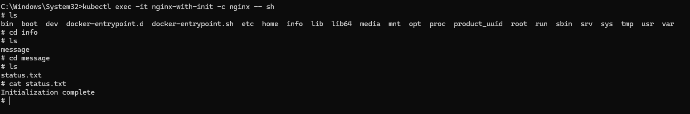

# 📘 Day 11 – Container Types in Kubernetes

## 🔹 Why "One Container per Pod"?

By design, Kubernetes encourages **one container per pod**:

* **Resources** – All containers in a pod share the same network namespace and volumes → harder to isolate.
* **Lifecycle** – If one container fails, the pod may restart entirely.
* **Debugging** – Logs/processes from multiple containers overlap, making troubleshooting harder.
* **Best Practice** – *One container = one responsibility*, which improves modularity, scaling, and reusability.

👉 However, there are valid cases where **multiple containers in a single pod** are useful. These patterns are **Sidecar** and **Init Containers**.

---

## 🔹 Sidecar Container

A **sidecar** is an auxiliary container that runs alongside the main application container.

### Use Case: Nginx Logs

* Main container → Runs Nginx web server
* Sidecar container → Reads `access.log` and streams it


### Commands

```bash
# View logs from sidecar
kubectl logs -f nginx-with-sidecar -c log-sidecar

# Generate traffic to Nginx
kubectl port-forward pod/nginx-with-sidecar 8000:80
```

---

## 🔹 Init Container

An **init container** runs **before** the main container starts.
They are often used for:

* Checking dependencies (like DB readiness)
* Setting up config files
* Running scripts


### Commands

```bash
# Watch init container run first
kubectl get pods -w

# Check message inside main container
kubectl exec -it nginx-with-init -c nginx -- cat /usr/share/nginx/html/message
```
---

## 📸 Screenshots

Log Files of Main Container


Init Container get created First


Accessing Files of Init Container from Main Conatiner 




---

## 🔹 Key Takeaways

* ✅ **Default rule** → 1 container per pod.
* ✅ **Sidecars** → Add functionality like logging, monitoring, service mesh.
* ✅ **Init containers** → Prepare environment before the main app starts.

This design keeps Kubernetes apps **scalable, debuggable, and production-ready**.
