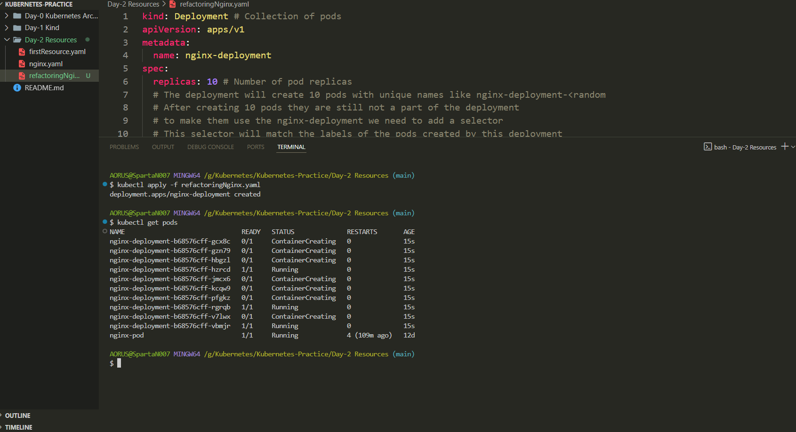

# 📘 Day 2 – Kubernetes Resource Quota and Pod Management

This document explains how to use **ResourceQuota** to limit the number of pods within a namespace in Kubernetes, and also covers the difference between **Pods** and **Deployments**, and the role of **Labels** and **Selectors**.

---

## 🔧 Resource Quota

ResourceQuota helps in limiting the use of resources such as CPU, memory, or the number of pods in a namespace.

### Sample YAML – `firstResource.yaml`
```yaml
kind: ResourceQuota
apiVersion: v1
metadata:
  name: dev-resource-quota
  namespace: dev
spec:
  hard:
    pods: "5"
```

✅ **Effect:** Limits the number of pods in the `dev` namespace to 5.

---

## 🧪 Pod Creation Test

### YAML to Create 6 Pods – `nginx.yaml`
```yaml
kind: Pod
apiVersion: v1
metadata:
  name: first-nginx-pod
  namespace: dev
spec: 
  containers:
  - name: first-nginx-container
    image: nginx
---
kind: Pod
apiVersion: v1
metadata:
  name: second-nginx-pod
  namespace: dev
spec: 
  containers:
  - name: second-nginx-container
    image: nginx
---
kind: Pod
apiVersion: v1
metadata:
  name: third-nginx-pod
  namespace: dev
spec: 
  containers:
  - name: third-nginx-container
    image: nginx
---
kind: Pod
apiVersion: v1
metadata:
  name: forth-nginx-pod
  namespace: dev
spec: 
  containers:
  - name: forth-nginx-container
    image: nginx
---
kind: Pod
apiVersion: v1
metadata:
  name: fifth-nginx-pod
  namespace: dev
spec: 
  containers:
  - name: fifth-nginx-container
    image: nginx
---
kind: Pod
apiVersion: v1
metadata:
  name: sixth-nginx-pod
  namespace: dev
spec: 
  containers:
  - name: sixth-nginx-container
    image: nginx
```

⚠️ **Only 5 pods will be created** due to the resource quota limit.

Use the command below to verify:
```bash
kubectl get pods -n dev
```

---

## ⚙️ Pods vs Deployments

- `kind: Pod` – Creates a single pod with a custom name.
- `kind: Deployment` – Creates and manages multiple pods. The pod names are autogenerated and not customizable.

---

### YAML to Create 10 Deployment – `refactoringNginx.yaml`
```bash
kind: Deployment # Collection of pods
apiVersion: apps/v1
metadata:
  name: nginx-deployment
spec:
  replicas: 10 # Number of pod replicas
  # The deployment will create 10 pods with unique names like nginx-deployment-<random
  # After creating 10 pods they are still not a part of the deployment
  # to make them use the nginx-deployment we need to add a selector
  # This selector will match the labels of the pods created by this deployment
  selector:
    matchLabels:
      app: nginx-app # Label to select the pods managed by this deployment
  template:
    metadata:
      labels:
        app: nginx-app # Label to identify the pods
    spec:
      containers:
      - name: nginx-container
        image: nginx
```
---
## 🏷️ Labels and Selectors

- **Labels**: Key–value tags for identifying and organizing pods. Helpful in grouping for services.
- **Selectors**: Allow deployments or services to target specific pods based on labels.

### Key Concepts

- `template -> metadata -> labels`: Used to assign labels to pods.
- `selector -> matchLabels`: Used to match the labels for pod targeting.

These are essential for managing large-scale Kubernetes deployments efficiently.

---
## 📸 Screenshots

Made a deployment by creating 10 replicas



📌 **Conclusion**: ResourceQuota ensures fair resource allocation, and labels + selectors help in organizing workloads effectively.

**Author:** Manoranjan Sethi

#Kubernetes #DevOps #CloudNative #LearningInPublic #K8s #ResourceQuota #Pods #Labels #Selectors