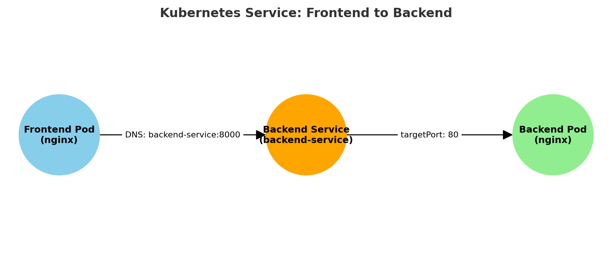
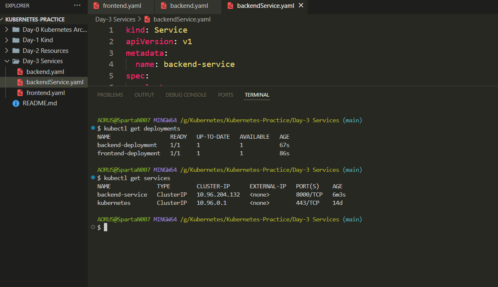
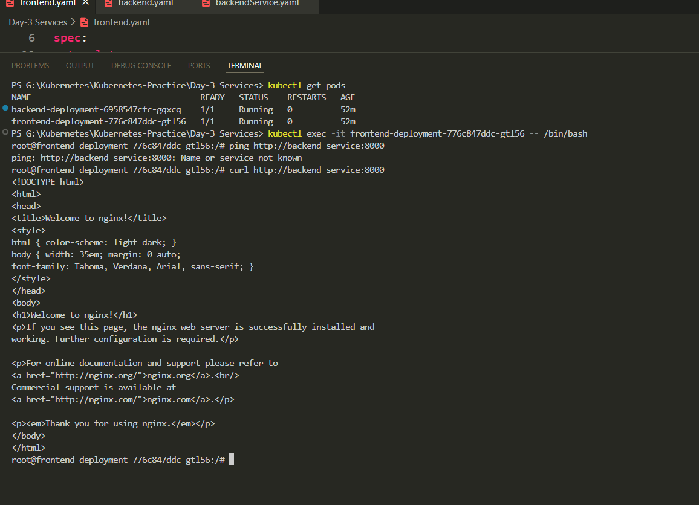

# 📘 Day 3 – Services in Kubernetes

A **Service** in Kubernetes is an abstraction that exposes a set of Pods as a network service.  
Since Pods are **ephemeral** (they can die and restart with different IP addresses), a Service ensures a **stable network endpoint** for communication.

---

## 🔹 Why Use a Service?
- 📌 **Stable IP / DNS Name** – Avoids IP change issues.
- ⚖️ **Load Balancing** – Distributes traffic between matching Pods.
- 🌐 **Exposure** – Can expose applications inside or outside the cluster.

---

## 🛠 Example Setup

### 1️⃣ Frontend Deployment (`frontend.yaml`)
```yaml
kind: Deployment
apiVersion: apps/v1
metadata:
  name: frontend-deployment
spec:
  replicas: 1
  selector:
    matchLabels:
      app: frontend
  template:
    metadata:
      labels:
        app: frontend
    spec:
      containers:
      - name: frontend-container
        image: nginx
````

### 2️⃣ Backend Deployment (`backend.yaml`)

```yaml
kind: Deployment
apiVersion: apps/v1
metadata:
  name: backend-deployment
spec:
  replicas: 1
  selector:
    matchLabels:
      app: backend
  template:
    metadata:
      labels:
        app: backend
    spec:
      containers:
      - name: backend-container
        image: nginx
```

### 3️⃣ Backend Service (`backendService.yaml`)

```yaml
kind: Service
apiVersion: v1
metadata:
  name: backend-service
spec:
  selector:
    app: backend
  ports:
  - port: 8000       # Service port
    targetPort: 80   # Backend pod's container port
```
---
## 📸 Architecture Diagram




---

## ⚡ Debugging Issue Faced

While trying to get into the frontend pod's bash shell:

```
error executing command in container: exec: "C:/Program Files/Git/usr/bin/bash": no such file or directory
```

**Cause:** I was using Git Bash for command execution.
**Solution:** Switched to **Windows Terminal**, and it worked.

---

## 🔗 Testing the Connection

From inside the frontend pod:

```bash
curl http://backend-service:8000
```

✅ Successfully connected to the backend service.

---
## 📸 Screenshots

Frontend+Backend+Service Deployment



Communication from Frontend to Backend



---

## 📌 Key Takeaways

* Services provide **stable communication** between Pods.
* Using `kubectl exec` with the correct terminal avoids shell path issues on Windows.
* Port mapping in a Service is crucial for backend connectivity.

---

**Author:** Manoranjan Sethi


\#Kubernetes #DevOps #Services #Networking #CloudNative

