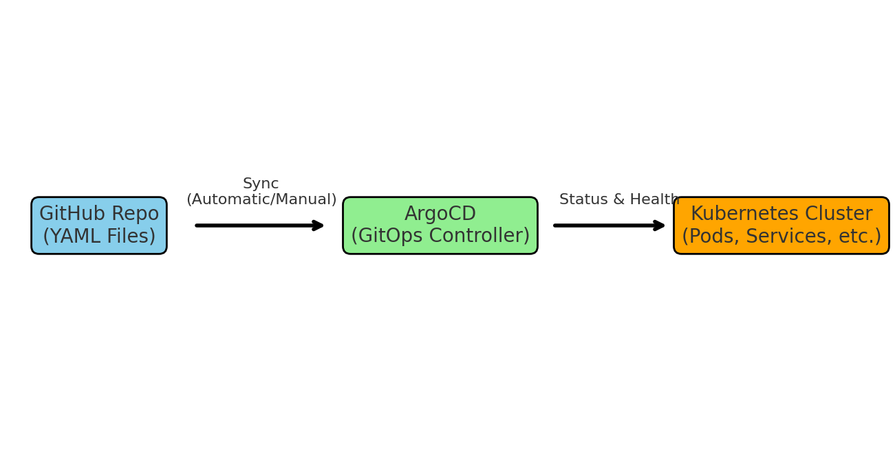
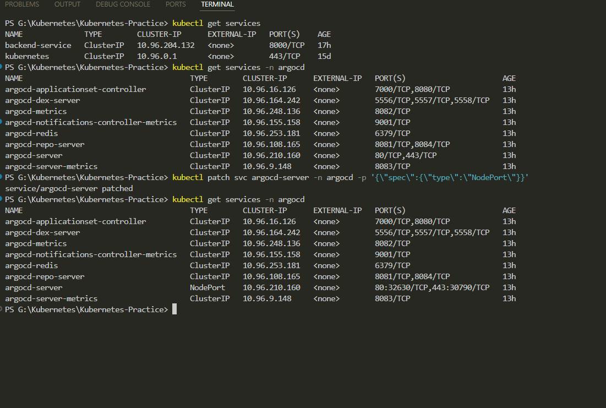
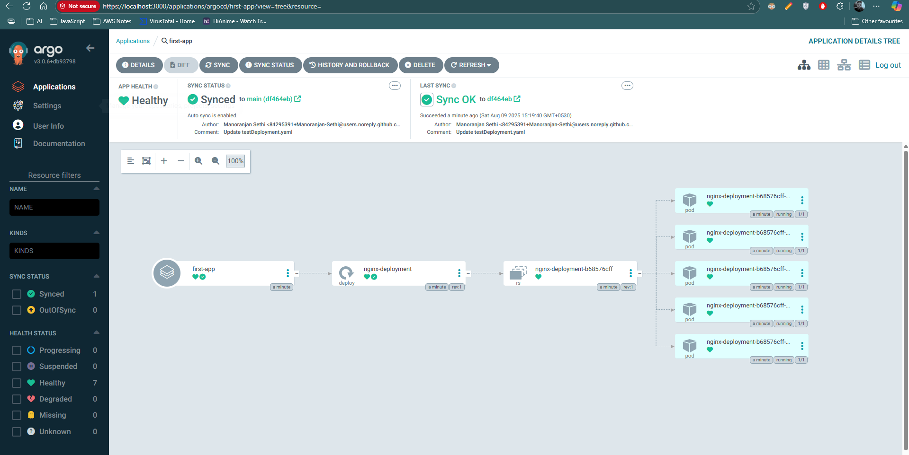

# Day 4 - ArgoCD with Kubernetes

## Overview
Today I explored **ArgoCD**, a powerful GitOps tool used to manage Kubernetes deployments directly from a Git repository.  
The goal was to access the deployment from **outside the cluster** by changing the default Service type from **ClusterIP** to **NodePort**.

---

## Steps Followed

### 1. Deployment YAML
Uploaded `argocdNginx.yaml` to GitHub:
```yaml
kind: Deployment
apiVersion: apps/v1
metadata:
  name: nginx-deployment
spec:
  replicas: 5
  selector:
    matchLabels:
      app: nginx-app
  template:
    metadata:
      labels:
        app: nginx-app
    spec:
      containers:
      - name: nginx-container
        image: nginx
```

### 2. Install ArgoCD
1. Create namespace for ArgoCD:
```bash
kubectl create namespace argocd
```
2. Install ArgoCD in the namespace.
3. Verify installation:
```bash
kubectl get svc -n argocd
```

### 3. Change Service Type to NodePort
```bash
kubectl patch svc argocd-server -n argocd -p '{"spec":{"type":"NodePort"}}'
```
This allows ArgoCD UI to be accessed in the browser.

### 4. Port Forwarding
```bash
kubectl port-forward svc/argocd-server -n argocd 3000:443 --address=0.0.0.0
```
Access in browser:  
- **Username**: `admin`  
- **Password**:
```bash
pass=$(kubectl -n argocd get secret argocd-initial-admin-secret -o jsonpath="{.data.password}")
echo $pass | base64 --decode
```

### 5. Creating an Application in ArgoCD
- **Source**: GitHub repo with YAML manifests.
- **Branch**: Chosen branch.
- **Destination**: Default cluster URL and namespace.
- **Sync Policy**: Set to automatic for continuous updates.

### 6. Testing Auto Sync
- Changed replicas from `5` to `7` in YAML → ArgoCD automatically created 2 more pods.
- Changed replicas to `3` → ArgoCD deleted excess pods.

---

## Workflow Diagram


---

## 📸 Screenshots

ArgoCD Services with Service Type Changes


ArgoCD Browser Access with Application Details Tree



---

## Key Learnings
- ArgoCD enables declarative GitOps for Kubernetes.
- Changing Service type from **ClusterIP** to **NodePort** allows browser access.
- Auto-sync keeps deployments always in the desired state.

**Author:** Manoranjan Sethi