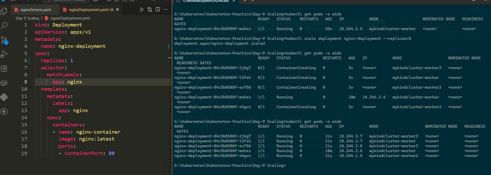
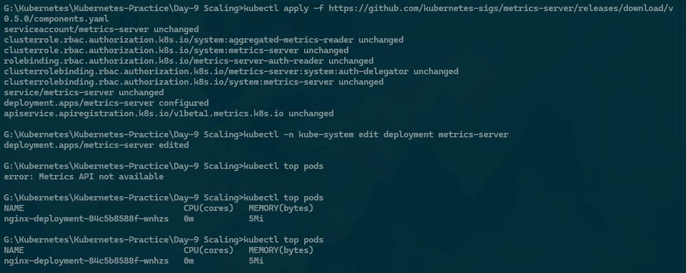
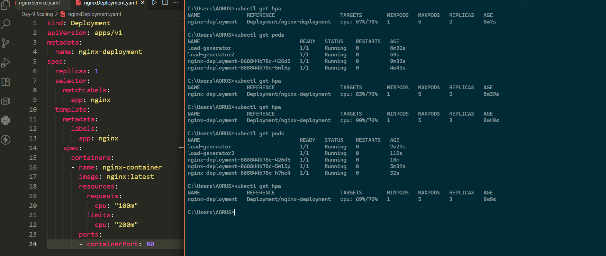

# Day 9 – Scaling in Kubernetes

## 📌 Overview
Scaling in Kubernetes ensures that workloads adjust automatically to demand.  
The **Horizontal Pod Autoscaler (HPA)** is a Kubernetes resource that changes the number of pod replicas in a **Deployment, ReplicaSet, or StatefulSet** based on metrics like **CPU, memory, or custom metrics**.

---

## ⚙️ How HPA Works
1. **Metrics Collection** – HPA queries the **Metrics Server** (or Prometheus) to get real-time pod usage.  
2. **Target Utilization** – Define desired CPU/Memory usage (e.g., CPU=50%).  
3. **Calculation** – HPA compares actual vs. desired usage.  
4. **Scaling Action** – Adjusts replicas in the deployment automatically.

---

## 🛠️ Hands-on Implementation

### 1️⃣ Nginx Deployment with Resources
```yaml
apiVersion: apps/v1
kind: Deployment
metadata:
  name: nginx-deployment
spec:
  replicas: 1
  selector:
    matchLabels:
      app: nginx-app
  template:
    metadata:
      labels:
        app: nginx-app
    spec:
      containers:
      - name: nginx-container
        image: nginx:latest
        resources:
          requests:
            cpu: "100m"
          limits:
            cpu: "200m"
        ports:
        - containerPort: 80
````

### 2️⃣ Manual Scaling

```bash
kubectl scale deployment nginx-deployment --replicas=5
```

### 3️⃣ Install Metrics Server

```bash
kubectl apply -f https://github.com/kubernetes-sigs/metrics-server/releases/download/v0.5.0/components.yaml
```

* Runs inside the `kube-system` namespace.
* Fix TLS issues by editing the deployment:

  ```bash
  kubectl -n kube-system edit deployment metrics-server
  ```

  Add:

  ```yaml
  - --kubelet-insecure-tls
  ```

Check pod metrics:

```bash
kubectl top pods
```

### 4️⃣ Create HPA

```bash
kubectl autoscale deployment nginx-deployment --cpu-percent=70 --min=1 --max=10
```

### 5️⃣ Load Testing with BusyBox

```bash
kubectl run -it --rm load-generator --image=busybox -- /bin/sh
while true; do wget -q -O- http://nginx-service; done
```
---

## 📸 Screenshots

Increase the Number of Pods Manually



Adding `--kubelet-insecure-tls` to github file in `specs`


See the Utilization



AutoScaled Pods after Busybox test



---

## ✅ Key Takeaways

* HPA ensures **efficient resource utilization**.
* Pods **scale up** under heavy load and **scale down** when idle.
* Saves cost while maintaining **application availability**.

---

## 📊 Useful Commands

```bash
kubectl get hpa
kubectl describe hpa nginx-deployment
kubectl top pods
kubectl top nodes
```

---

#Kubernetes #HPA #Scaling #DevOps #CloudNative

